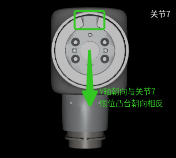

# OneroArm API · 用户手册

OneRobotics A1 系列机械臂的官方预编译 SDK 与 Python 安装包。本手册是面向最终集成开发者的**接口索引**：以 C++ 接口为示例罗列三层公共面的全部函数与作用，**完整签名 / 数据结构 / 可运行示例**统一下沉到各语言子 README，请按需跳转：

- [`c/README.md`](c/README.md) — 纯 C ABI 包（FFI / 纯 C 工程）
- [`c++/README.md`](c++/README.md) — C++ SDK（`namespace onero_api`）
- [`python/README.md`](python/README.md) — Python 包（`import oneroarm`）
- [`demo/README.md`](demo/README.md) — 三语言并列的可运行示例

> **版本**：1.1.0 · **支持平台**：Linux x86_64 / Linux arm64 / Linux riscv64 / Windows x86_64 · **C++ 标准**：C++17+ · **Python**：3.12

> ### 文档导航
>
> 本手册仅为三层接口的**速查索引**，只列出函数与作用；完整规格与可运行工程分置于各子目录，集成时请按下表查阅：
>
> | 需求 | 位置 | 内容 |
> |---|---|---|
> | 查阅接口完整规格 | 对应语言子 README：[`c/README.md`](c/README.md) · [`c++/README.md`](c++/README.md) · [`python/README.md`](python/README.md) | 完整函数签名、参数约束、数据结构与字段表、错误码、默认值、安装步骤与故障排查 |
> | 参考完整构建案例 | [`demo/README.md`](demo/README.md) 及 [`demo/`](demo/) 源码 | 各动作的 C / C++ / Python 可运行示例，含 CMake 一键构建、运行命令与无硬件下的预期行为，可直接作为集成模板 |
>
> 语言层选择与中断回调差异见 [§1.2 三层公共接口](#12-三层公共接口)。

---

## 目录

- [OneroArm API · 用户手册](#oneroarm-api--用户手册)
  - [目录](#目录)
  - [一、概述](#一概述)
    - [1.1 仓库布局](#11-仓库布局)
    - [1.2 三层公共接口](#12-三层公共接口)
  - [二、术语与返回值约定](#二术语与返回值约定)
    - [2.1 单位与坐标系](#21-单位与坐标系)
      - [URDF 坐标系与结构件关系](#urdf-坐标系与结构件关系)
    - [2.2 线程与生命周期](#22-线程与生命周期)
    - [2.3 `MoveResult` 错误码](#23-moveresult-错误码)
    - [2.4 原始 CAN 帧错误码](#24-原始-can-帧错误码)
    - [2.5 各方法返回值语义索引](#25-各方法返回值语义索引)
  - [三、配置入口 `OneroConfig` / `onero_config_t`](#三配置入口-oneroconfig--onero_config_t)
  - [四、接口速查表（以 C++ 为例）](#四接口速查表以-c-为例)
    - [4.1 `OneroArm`](#41-oneroarm)
      - [▌ 生命周期 / 使能](#-生命周期--使能)
      - [▌ 运动控制（自带规划，遵循 `trajectory_connect`）](#-运动控制自带规划遵循-trajectory_connect)
      - [▌ 可选夹爪](#-可选夹爪)
      - [▌ 轨迹缓冲（**仅服务 `trajectory_connect=1` 累积的队列**）](#-轨迹缓冲仅服务-trajectory_connect1-累积的队列)
      - [▌ 直接 MIT 力矩下发（⚠ **不做规划，与 trajectory buffer 无关**）](#-直接-mit-力矩下发-不做规划与-trajectory-buffer-无关)
      - [▌ MIT 力位混合直接控制](#-mit-力位混合直接控制)
      - [▌ 状态查询](#-状态查询)
      - [▌ 原始 CAN 帧（行为约定见 §五）](#-原始-can-帧行为约定见-五)
    - [4.2 `OneroDragTeaching`](#42-onerodragteaching)
  - [五、原始 CAN 帧 API 行为约定](#五原始-can-帧-api-行为约定)
  - [六、版本与许可](#六版本与许可)

---

## 一、概述

### 1.1 仓库布局

```text
OneroArm_API_for_Users/
├── README.md                                # 本手册（接口索引 + 速查表）
│
├── c/                                       # 纯 C ABI 包：FFI / 纯 C 工程
│   ├── include/onero_interface_c.h          # 唯一公开头（自含数据类型，零 C++ 依赖）
│   ├── linux/{linux-x86_64, linux-arm64, linux-riscv64}/liboneroarm.so
│   ├── windows/windows-x86_64/{oneroarm.dll, oneroarm.lib}
│   ├── share/oneroarm_description/          # URDF + mesh，运行时 dladdr 自动定位
│   └── README.md
│
├── c++/                                     # C++ SDK 包：namespace onero_api
│   ├── include/
│   │   ├── onero_define.h                   # 数据类型 / 常量 / 错误码
│   │   └── onero_interface_cpp.h            # 公开类（自动 #include "onero_define.h"）
│   ├── linux/{linux-x86_64, linux-arm64, linux-riscv64}/liboneroarm.so
│   ├── windows/windows-x86_64/{oneroarm.dll, oneroarm.lib}
│   ├── share/oneroarm_description/
│   └── README.md
│
├── python/                                  # Python 包：conda channel + RISC-V 瘦 wheel
│   ├── conda_channel/linux/{linux-64, linux-aarch64, noarch}/
│   ├── conda_channel/windows/{win-64, noarch}/
│   ├── wheels/linux-riscv64/oneroarm-*.whl  # RISC-V 专用瘦 wheel（cp312；conda-forge 无 riscv64 包）
│   └── README.md
│                                            # 安装后 import oneroarm；扩展模块、类型存根、
│                                            # share/oneroarm_description 一并落到 site-packages
│
├── demo/                                    # 三语言并列示例
│   ├── {full,movej,movep,movel,buffered_traj,can_frame,drag_teaching}_demo.{c,cpp,py}
│   ├── CMakeLists.txt                       # 极简分发：直接 IMPORTED target，无 find_package
│   └── README.md
│
└── scripts/
    └── install_riscv_dependencies.sh        # RISC-V 一次性源码编第三方依赖到 /opt/onero-deps
```

> `c/` 与 `c++/` 是两个**真拆分包**：预编译二进制 `liboneroarm.so` / `oneroarm.dll` 在两包内**逐字节相同**，差异只在 `include/`：`c/include/` 只有 1 个自含的纯 C 头；`c++/include/` 有 2 个 C++ 头，`onero_interface_cpp.h` 自动 `#include "onero_define.h"`，用户代码只需引前者。
>
> `share/oneroarm_description/` 在两个 SDK 包都内置一份；SDK 通过 `dladdr()` / `GetModuleFileNameW()` 取自身 `.so` / `.dll` 路径，按 `<libdir>/../share/oneroarm_description/` 自动定位 URDF/mesh，**零配置**即可工作。


### 1.2 三层公共接口

功能完全等价，按工程语言挑一层即可：

| 层 | 入口符号 | 对应头 / 模块 | 适用场景 |
|---|---|---|---|
| **C++** | `onero_api::OneroArm` / `OneroDragTeaching` | `c++/include/onero_interface_cpp.h`（`onero_define.h` 自动 include） | C++17+ 工程；额外暴露 `interrupt_check` 中断回调 |
| **C ABI** | `onero_create_robot` / `onero_*` 系列 | `c/include/onero_interface_c.h`（`extern "C"` + 自含 POD） | 纯 C 工程；其他语言 FFI（Rust / Go / C# 等） |
| **Python** | `oneroarm.OneroArm` / `oneroarm.OneroDragTeaching` | `import oneroarm`（pybind11 扩展） | 快速原型、数据采集、上层算法集成；不暴露 `interrupt_check` |

> 三层均对接同一个 `liboneroarm.so` / `oneroarm.dll`，业务行为完全一致；选谁取决于工程语言与是否需要中断回调。安装与集成方式见各语言子 README。

---

## 二、术语与返回值约定

### 2.1 单位与坐标系

| 项 | 约定 |
|---|---|
| 关节角度 / 速度 / 力矩 | rad / rad·s⁻¹ / N·m，索引 `0..dof-1`，与 URDF 一致 |
| 笛卡尔位置 | m，基坐标系 |
| 笛卡尔姿态 | 单位四元数 `(qw, qx, qy, qz)`，标量优先 |
| 时间步长 | s，拖动示教默认 `0.01`（100 Hz） |
| `speed_scale` | 无量纲速度比例，建议 `(0, 2.0]`，默认 `1.0` |
| **`trajectory_connect`** | 仅作用于 `movej` / `movel` / `movep` 的最后一个参数。`0` = 立即执行（若已有累积段，先把缓冲段连成一条平滑轨迹执行，再走当前段）；`1` = 把当前段塞进内部 `trajectory_buffer_`，**等 `execute_buffered_trajectory()` 或下一次 `trajectory_connect=0` 调用时一次性下发**。这是 SDK 唯一的"轨迹缓冲"机制；与 `send_trajectory*` **无关**（详见 §4.1）。 |

#### URDF 坐标系与结构件关系

下图用于说明 URDF 中各坐标系与实际结构件的对应关系；A1 左臂与右臂均满足该关系，可按同一方式理解 `link` / `joint` 与 mesh 的绑定。

<p align="center">
  
  
</p>

### 2.2 线程与生命周期

- 同一实例 / 句柄上的方法**不是**线程安全的；多线程必须由调用方串行化。
- `get_arm_state_cached` 是唯一为后台轮询设计的接口，不触发 CAN I/O。
- `move*` 系列同步阻塞至运动完成或失败；`enable/disable_motors` 同步等待硬件应答；`cancel_trajectory` 异步终止。
- C ABI 句柄由 `onero_destroy_robot` / `onero_drag_teaching_destroy` 释放，释放后必须置空。C++ / Python 由实例析构自动完成。

### 2.3 `MoveResult` 错误码

| 值 | 名称 | 含义 |
|:---:|---|---|
| `0` | `SUCCESS` | 成功 |
| `-1` | `INVALID_PARAMS` | 参数错误（dof 不匹配 / 数组长度异常 / 速度越界等） |
| `-2` | `IK_FAILED` | 笛卡尔目标的逆运动学求解失败 |
| `-3` | `COLLISION_DETECTED` | 自碰撞检测告警 |
| `-4` | `EXECUTION_FAILED` | 下发指令时硬件 / 通信异常 |
| `-5` | `TIMEOUT` | 等待超时（含使能、应答超时等） |

### 2.4 原始 CAN 帧错误码

定义在 `onero_define.h` / `onero_interface_c.h`（`ONERO_ERR_RAW_FRAME_*`）。

| 值 | 名称 | 含义 |
|:---:|---|---|
| `0` | `ONERO_CAN_OK` | 成功 |
| `-10` | `ONERO_ERR_RAW_FRAME_INVALID_LEN` | payload 长度越界（必须 ∈ [0, 8]） |
| `-11` | `ONERO_ERR_RAW_FRAME_INVALID_ID` | CAN ID 越界（必须 ∈ [0x000, 0x7FF]） |
| `-12` | `ONERO_ERR_RAW_FRAME_RESERVED_ID` | CAN ID 落在 SDK 保留集（电机 / 夹爪 / 操纵杆 / `0x7FF`） |
| `-13` | `ONERO_ERR_RAW_FRAME_PORT_NOT_OPEN` | 串口未打开 / 句柄无效 |
| `-14` | `ONERO_ERR_RAW_FRAME_SEND_FAILED` | SLCAN 写串口失败 |

### 2.5 各方法返回值语义索引

| 类别 | 含义 | 涉及方法 |
|---|---|---|
| `int = MoveResult` | `0=SUCCESS`，负数 = §2.3 错误码 | `enable_motors` / `disable_motors` / `movej` / `movel` / `movep` / `send_trajectory_point` / `send_trajectory` / `cancel_trajectory` / `execute_buffered_trajectory` / `clear_trajectory_buffer` |
| `int = ONERO_ERR_RAW_FRAME_*` | `0=OK`，负数 = §2.4 错误码 | `send_can_frame` / `register_can_frame_callback` / `clear_can_frame_callback` / `pump_can_bus` |
| `bool` | `true=成功` | `is_hardware_connected` / `OneroDragTeaching::initialize` / `set_hardware` / `is_initialized` |
| `int`（拖动示教族） | `0=成功`，非 0 = 失败 | `OneroDragTeaching::enable_motors` / `start_recording` / `stop_recording` / `start_replay` / `stop_replay` / `handle_command` |
| 数据对象 | 失败回退为空容器 / 全零 Pose / `count==0` / `IDLE` | `get_joint_positions(_from_motors)` / `get_joint_velocities` / `get_arm_state_from_motor(_cached)` / `get_end_effector_pose` / `OneroDragTeaching::get_state` |
| 句柄 / Python 异常 | C ABI 返回 `NULL`；C++ `valid()==false`；Python 构造失败抛异常 | `onero_create_robot` / `onero_drag_teaching_create` / `OneroArm` ctor / `OneroDragTeaching` ctor |

---

## 三、配置入口 `OneroConfig` / `onero_config_t`

三层共享同一组字段（语义对齐，字段顺序不强求一致）：

| 字段 | 必填 | 默认 | 说明 |
|---|:---:|---|---|
| `device` | ✅ | `""` | 串口设备路径。Linux `/dev/ttyACM0`，Windows `COM3` |
| `robot_model` | ✅ | `""` | 机型名（子串包含、大小写敏感）。当前仅支持 `a1_l` / `a1_r` |
| `dof` | – | `7` | 自由度，仅支持 `7` |
| `baud_rate` | – | `921600` | 串口波特率 |
| `urdf_path` | – | `""` | URDF 文件绝对路径。留空时由 `model_description_path` + `version` 自动定位 |
| `version` | – | `""` | URDF 子目录名（`A1`）。留空时按 `robot_model` 自动推断 |
| `mount_orientation` | – | `vertical` | 安装姿态：`vertical` 立装 / `horizontal` 卧装。**装错将导致重力补偿方向错误** |
| `with_gripper` | – | `false` | 是否随臂注册 arm-owned 可选夹爪（复用同一串口 / CAN 会话，固定 CAN ID `0x08/0x18`）。详见 §4.1「可选夹爪」 |
| `mit_kp[7]` | – | 全 `0` | MIT 比例增益。逐关节回退：`==0` 视为未传入，按 `dof` 注入默认 |
| `mit_kd[7]` | – | 全 `0` | MIT 微分增益。同上 |
| `model_description_path` | – | `""` | `oneroarm_description` 根目录。留空 → SDK 内置（推荐） |

> **零初始化要求**：C ABI 的 `onero_config_t` **必须**先 `{0}` / `memset` 清零，否则栈上随机值会被误判为「用户传入的非 0 PD 增益」。C++ 结构体在头文件内声明默认值，`onero_config_t cfg{}` 即安全。
>
> **PD 默认增益（7-DOF）**：`kp = [150, 150, 150, 150, 30, 30, 30]`，`kd = [4, 4, 4, 4, 1, 1, 1]`。
>
> **URDF/mesh 资源**：默认零配置即可命中 SDK 内置 `share/oneroarm_description/`；如需自定义可设 `ONERO_DESCRIPTION_PATH` 或显式赋 `model_description_path`。

字段细节、平台差异、构造范例请见各语言子 README。

---

## 四、接口速查表（以 C++ 为例）

> **使用方法**：本节用 **C++ 签名**展示参数与作用；纯 C ABI / Python 函数名与 C++ 一一对应（C ABI 加 `onero_` 前缀并以句柄为首参；Python 同名 `snake_case`，参数同序），**完整签名、数据结构、默认值**请按需查阅：
>
> - C++ — [`c++/include/onero_interface_cpp.h`](c++/include/onero_interface_cpp.h)、[`c++/include/onero_define.h`](c++/include/onero_define.h)
> - C ABI — [`c/include/onero_interface_c.h`](c/include/onero_interface_c.h)
> - Python — `import oneroarm; help(oneroarm.OneroArm)`，或 [`python/README.md`](python/README.md)
>
> **完整构建案例**：上述接口的端到端调用、编译与运行方式参见 [`demo/`](demo/) 源码与 [`demo/README.md`](demo/README.md)，每组动作均提供 C / C++ / Python 三份可运行示例及 CMake 一键构建步骤。
>
> 如需了解某个接口在 SDK 内部的具体实现（规划器、控制律、状态机），可阅读核心源码：`OneroArm_API_for_develop/C_API/src/onero_core.cpp` 等。

### 4.1 `OneroArm`

#### ▌ 生命周期 / 使能

| C++ 签名 | 参数含义 | 作用 |
|---|---|---|
| `OneroArm(const onero_config_t& cfg)` | `cfg`：见 §三 | RAII 构造：打开串口、加载 URDF、初始化运动控制；析构自动释放 |
| `bool valid() const` | — | 构造是否成功（串口打开 + 模型加载 OK） |
| `int enable_motors()` | — | 同步使能所有关节电机 (*注意*：使能时会自动回零位，需要在使能前将机械臂移动到接近零位)|
| `int disable_motors()` | — | 同步失能所有关节电机 （*注意*：失能会使的机械臂自由下落，在失能前请确保机械臂处于安全位置）|

  - 在连续运动过程中不需要重复调用 `enable_motors`及 `disable_motors`。
  - 在失能后建议将实例销毁（析构）后阻塞一段时间（500ms以上），以确保电机稳定并没有残余CAN帧发送再连续使能。

#### ▌ 运动控制（自带规划，遵循 `trajectory_connect`）

| C++ 签名 | 参数含义 | 作用 |
|---|---|---|
| `int movej(const JointArray& target, double speed_scale=1.0, uint8_t trajectory_connect=0)` | `target`：目标关节角 (rad)；`speed_scale`：速度比例 (0, 2.0]；`trajectory_connect`：见 §2.1 | 关节空间运动到目标，内部按多项式 / 三次样条规划 |
| `int movel(const Pose& pose, double speed_scale=1.0, uint8_t trajectory_connect=0)` | `pose`：目标位姿 (m + 单位四元数)；其他同上 | 笛卡尔**直线**运动（末端走直线，需求解 IK） |
| `int movep(const Pose& pose, double speed_scale=1.0, uint8_t trajectory_connect=0)` | 同上 | 笛卡尔**点到点**（关节空间插值，自动避碰） |

#### ▌ 可选夹爪

> 选配，默认关闭，需 `cfg.with_gripper = true` 随臂创建。复用 `OneroArm` 同一串口 / CAN 会话（固定 CAN ID `0x08/0x18`），不单独打开设备；`enable_motors()` 只使能机械臂关节，夹爪需显式 `gripper()->enable()`。C++ 经 `arm.gripper()`（`with_gripper=false` 时为 `nullptr`）取控制器，Python 为 `arm.gripper` 属性（未开启时 `None`）。夹爪状态 / 故障码只属于夹爪域，不改变机械臂 `dof` 或关节状态缓存。

| C++ 签名 | 参数含义 | 作用 |
|---|---|---|
| `bool has_gripper() const` | — | 是否随臂创建了夹爪控制器 |
| `OneroGripper* gripper()` | — | 取夹爪控制器；`with_gripper=false` 时为 `nullptr` |
| `int enable()` / `int disable()` | — | 使能 / 失能夹爪电机（固定 ID `0x08/0x18`，与 `enable_motors()` 解耦） |
| `int set_position(double percent)` | `percent`：`0..100` | 单帧位置保持 |
| `int move_position(double percent, double max_vel=100.0, double max_acc=250.0, double max_jerk=1000.0)` | `percent`：`0..100`；速度 / 加速度 / 加加速度上限 | 100 Hz 点到点 S 曲线规划 |
| `int force_control(double torque)` | `torque`：N | 下发夹爪 MIT 力矩，内部钳位 ±40 N |
| `GripperStatus status()` | — | 刷新并返回 `position` / `velocity` / `force` / `error` / `valid` |
| `GripperTactileStatus get_tactile()` | — | 刷新并返回两个触摸传感器各自的合力与 9 个测点快照 |

> **触觉**：读取传感器 `0x01` / `0x02` 的 `0x00..0x09`，`0x00` 写入 `total_force`，`0x01..0x09` 写入 `points`；`fx/fy` 按 `int8_t * 0.1N`、`fz` 按 `uint8_t * 0.1N` 解析。完整字段与示例见各语言子 README。

#### ▌ 轨迹缓冲（**仅服务 `trajectory_connect=1` 累积的队列**）

| C++ 签名 | 参数含义 | 作用 |
|---|---|---|
| `int execute_buffered_trajectory()` | — | 把所有 `trajectory_connect=1` 累积进 `trajectory_buffer_` 的段连成一条平滑轨迹一次性下发 |
| `int clear_trajectory_buffer()` | — | 清空 `trajectory_buffer_`，所有缓冲段丢弃；不影响正在执行的运动 |
| `int cancel_trajectory()` | — | 异步打断当前正在执行的 move（无论是单段还是缓冲触发） |

#### ▌ 直接 MIT 力矩下发（⚠ **不做规划，与 trajectory buffer 无关**）

> **重要**：以下两个接口在 SDK 内部直接调用 `motor_control_->control_mit(motors_[i], kps_[i], kds_[i], pos[i], vel[i], tau[i])` 给每个关节电机下发 MIT 力矩；力矩由调用方传入的 `(q, qd, qdd)` 经 `RigidBodyDynamics::InverseDynamics` 反算。
>
> **SDK 不做任何插值 / 平滑 / 时间规划，也不入 `trajectory_buffer_`**。调用方必须先用三次样条 / 五次多项式 / minimum-jerk 等方法把目标轨迹离散化、保证 `(q, qd, qdd)` 时间上连续，否则**仿真机械臂关节会跳变**。
>
> **不要**用 `execute_buffered_trajectory` 来"触发"它们 —— 二者完全不耦合，前者只服务 `movej/movel/movep` 的 `trajectory_connect` 队列。

| C++ 签名 | 参数含义 | 作用 |
|---|---|---|
| `int send_trajectory_point(const JointArray& positions, const JointArray& velocities)` | 单点：关节位置 / 速度（与 dof 等长） | 单点 MIT 下发；调用方应在外部以固定周期连续调用 |
| `int send_trajectory(const std::vector<TrajectoryPoint>& trajectory)` | 一组 (位置, 速度, 加速度) | 逐点 MIT 下发；**调用前必须自行规划好整段轨迹** |

#### ▌ MIT 力位混合直接控制

> 低层力位混合（阻抗）接口，用于 teleop 数据采集、阻抗控制、模仿学习推断等。控制律 `tau_motor = kp*(q - q_act) + kd*(dq - dq_act) + tau` 由电机在 MIT 模式下闭环执行。调用前先 `enable_motors()`；所有 `JointArray` 长度 = `dof`，需以 ≥100 Hz 持续下发，**不要**与 `movej/movel/movep` 在重叠时间窗内混用。

| C++ 签名 | 参数含义 | 作用 |
|---|---|---|
| `int control_mit(const JointArray& kp, const JointArray& kd, const JointArray& q, const JointArray& dq, const JointArray& tau)` | 五个 `JointArray`，长度 = `dof` | 整臂 MIT 力位混合控制（每帧一次）。`0` 成功 / `-1` 参数错误 / `-2` 硬件未初始化 / `-3` 至少一关节 CAN 写入失败 |
| `int compute_gravity_torque(const JointArray& q, JointArray& out_tau)` | `q` 输入 / `out_tau` 输出 | 计算重力补偿力矩（含 `robot_model` 校准缩放），喂给 `control_mit` 的 `tau`。`0` 成功 / `-1` `q` 长度错误 / `-2` 动力学模型未就绪 |

> `q` 走与 `get_arm_state_from_motor()` 一致的 SDK 关节空间，建议第一帧 `q=当前回读位置、dq=0、tau=0`。C ABI 为 `onero_control_mit` / `onero_compute_gravity_torque`。**Python 例外**：`compute_gravity_torque(q)` 直接返回 `JointArray`（而非 C/C++ 的「`int` 返回 + `out_tau` 出参」），模型未就绪 / 长度错误时抛 `ValueError`。

#### ▌ 状态查询

| C++ 签名 | 参数含义 | 作用 |
|---|---|---|
| `JointArray get_joint_positions()` | — | **不触发 CAN I/O**：返回上位机内部缓存 |
| `JointArray get_joint_positions_from_motors()` | — | 触发 CAN I/O 直接从电机读 |
| `JointArray get_joint_velocities()` | — | 触发 CAN I/O 读关节速度 |
| `ArmStateFromMotor get_arm_state_from_motor()` | — | 触发 CAN I/O，一次返回 (位置 / 速度 / 力矩) |
| `ArmStateFromMotor get_arm_state_cached()` | — | **推荐高频轮询用**：控制循环内部缓存，不触发 I/O |
| `Pose get_end_effector_pose()` | — | 末端正运动学位姿 |
| `bool is_hardware_connected()` | — | 串口是否打开 |

#### ▌ 原始 CAN 帧（行为约定见 §五）

| C++ 签名 | 参数含义 | 作用 |
|---|---|---|
| `int send_can_frame(uint16_t can_id, const uint8_t* payload, uint8_t len)` | `can_id`：11-bit 标准 ID（避开保留集）；`payload/len`：0..8 字节 | 向同总线**非保留** ID 发送原始帧 |
| `int register_can_frame_callback(CanFrameCallback cb)` | `cb`：`std::function<void(uint16_t, const uint8_t*, uint8_t)>` | 注册接收非保留 ID 帧的回调 |
| `int clear_can_frame_callback()` | — | 清除已注册的回调 |
| `int pump_can_bus(int timeout_ms)` | 阻塞超时（ms），`0` 等价非阻塞 try-recv | 主动驱动一次串口 rx，避免 SLCAN 缓冲累积 |

### 4.2 `OneroDragTeaching`

| C++ 签名 | 参数含义 | 作用 |
|---|---|---|
| `OneroDragTeaching()` | — | 默认构造；后续需 `initialize()` + `set_hardware()` 才能用 |
| `bool initialize(int dof, const std::string& record_file, double time_step=0.01)` | dof / 录制文件路径 / 控制周期 (s) | 配置示教参数，分配缓冲 |
| `bool set_hardware(const std::string& device, const std::string& urdf_path, const std::string& robot_model, const std::string& mount_orientation="horizontal")` | 串口 / URDF / 机型 / 安装姿态 | 绑定硬件并加载模型 |
| `bool set_hardware(..., const std::string& mount_orientation, bool with_gripper)` | 同上 + `with_gripper` | 重载：额外用 `with_gripper` 选择带夹爪的重力补偿缩放占位参数（此重载下 `mount_orientation` 须显式给出）。C ABI 为 `onero_drag_teaching_set_hardware_ex`；Python 为 `set_hardware(..., with_gripper=False)` |
| `int enable_motors(bool restore_to_zero=true)` | 是否先回零 | 使能并切到拖动示教模式 |
| `int start_recording()` / `int stop_recording()` | — | 开始 / 停止记录拖动轨迹 |
| `void set_replay_file(const std::string& f)` | 重放源文件 | 配置重放数据来源 |
| `int start_replay()` / `int stop_replay()` | — | 开始 / 停止重放 |
| `int handle_command(int cmd)` | 命令枚举 | 文本命令派发 |
| `void timer_callback()` | — | 控制循环 tick（外部周期调用） |
| `DragTeachingState get_state()` | — | `IDLE / RECORDING / REPLAYING` |
| `bool is_initialized()` | — | 是否已 `initialize()` |
| `void update_joint_state(const JointArray& pos, const JointArray& vel, const JointArray& eff)` | 三个等长 JointArray | 注入外部观测，仅在自定义控制循环中使用 |

> 字段表、参数约束、完整 demo 与故障排查 → [`c++/README.md`](c++/README.md) / [`c/README.md`](c/README.md) / [`python/README.md`](python/README.md)。

---

## 五、原始 CAN 帧 API 行为约定

C / C++ / Python 三层均提供 `send_can_frame` / `register_can_frame_callback` / `clear_can_frame_callback` / `pump_can_bus` 四个方法（签名仅随语言风格变化），共享以下行为约定：

- **物理总线**：与电机 / 夹爪共用同一根 SLCAN 串口；可向同总线上的自定义节点（MCU / 传感器 / IO 板等）下发 11-bit 标准 CAN 帧并接收响应。
- **保留 ID 集**：`0x01`、`0x02`、`0x03`、`0x04`、`0x05`、`0x06`、`0x07`、`0x08`、`0x11`、`0x12`、`0x13`、`0x14`、`0x15`、`0x16`、`0x17`、`0x7FF`。发到保留 ID 的帧会被 SDK 拦截并返回 `ONERO_ERR_RAW_FRAME_RESERVED_ID`，**不会下发到总线**；接收路径上保留 ID 帧仍走原解析，不会派发到用户回调。
- **回调线程**：在 SDK 接收路径（即调用方运动控制线程 / 当前调用 `pump_can_bus` 的线程）上**同步**执行。回调内**禁止重入** SDK 任何发送 / 运动控制方法，否则会与外层 receive 自锁。
- **payload 生命周期**：C / C++ 回调中的 `payload` 指针仅在回调期间有效，需要保留请自行拷贝；Python 回调收到的是已拷贝的 `bytes`。
- **异常**：Python 回调中抛出的异常会被 SDK 静默吞掉，避免回流到 SLCAN dispatch；业务侧应在回调内自行 `try/except`。
- `pump_can_bus(timeout_ms)`：`0` 等价一次非阻塞 try-recv；典型用法是在 `move*` 之类运动控制空闲期主动调用，避免 SLCAN rx 缓冲区累积。

返回值见 §2.4。**完整可运行示例**见各语言子 README。

---

## 六、版本与许可

- **当前版本**：1.1.0
- **License**：MIT
- **维护者**：OneRobotics 团队

---

> 安装、详细字段表、参数约束、可运行示例与故障排查请按需跳转：[`c/README.md`](c/README.md) / [`c++/README.md`](c++/README.md) / [`python/README.md`](python/README.md) / [`demo/README.md`](demo/README.md)。
